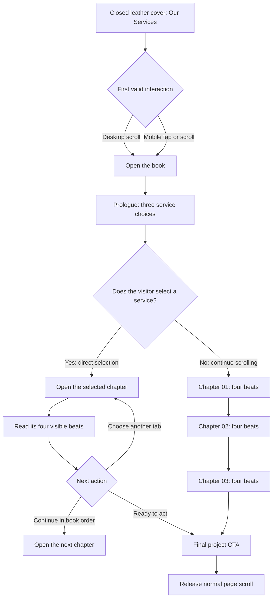

# Services Storybook Experience Brief

Status: Research-ready product, copy, and visual-direction brief

Scope: Services-section redesign only

Implementation status: No production code or assets approved yet

## 1. Objective

Replace the current long horizontal-services journey with an interactive storybook that helps visitors:

1. understand the three services quickly,
2. jump directly to the service they already need,
3. experience all twelve service beats when they want the full story, and
4. reach a clear project-start action without unnecessary scrolling.

The book should be memorable, but clarity must remain more important than the metaphor.

## 2. Decisions Already Made

1. The section begins with a closed, dark-leather hardcover titled **Our Services**.
2. Desktop scrolling opens the book from left to right.
3. Mobile tap or scroll opens a portrait book from top to bottom.
4. There are three main service chapters and four content beats within each chapter.
5. Main chapter titles must identify the service directly. Storytelling belongs in the supporting copy and imagery, not in ambiguous navigation labels.
6. The four beats remain available, but they do not become four compulsory page turns.
7. Each main chapter occupies one spread and contains all four beats in a concise, scannable composition.
8. A visitor may select a service directly or continue through all three chapters and experience all twelve beats.
9. Each chapter receives a subtle page-tint change while preserving the same leather frame and paper system.
10. Hover, swipe, and page-edge interactions may enhance the experience, but visible buttons and keyboard access remain required.

## 3. Strategic Job

The section must help a Kenyan business owner answer:

- Which service fits where my business is now?
- What will CodeByLeon do?
- What will I receive?
- What should I do next?

The primary success condition is not reaching the last page. It is understanding the relevant service well enough to start a project or continue exploring intentionally.

## 4. Direct Service Architecture

The recommended titles deliberately prioritise immediate comprehension.

| Chapter | Navigation label | Main heading | Plain-language descriptor | Supporting promise |
|---|---|---|---|---|
| 01 | **Websites & Systems** | **Website Design & Digital Systems** | Websites, landing pages, client portals, and custom web workflows | Make the business easier to understand, trust, and contact |
| 02 | **Brand Identity** | **Brand Identity & Digital Refresh** | Visual identity, messaging direction, and website or brand renewal | Bring the public image in line with the business it has become |
| 03 | **Ongoing Design** | **Ongoing Design Support** | Recurring campaign, website, and everyday creative support | Keep creative work moving without restarting from zero each time |

These labels may be refined after audience-language research, but their service meaning must remain explicit.

## 5. The Twelve Beats

All twelve beats remain part of the experience. They are compressed into three chapter spreads rather than twelve mandatory page turns.

### Chapter 01: Website Design & Digital Systems

Page tint: warm cream with a restrained sunrise-peach influence.

1. **Visibility & Credibility**

   Your work may be credible while your online presence makes it difficult for potential clients to see that clearly.

2. **Strategy & Structure**

   We organise the message, content, user path, and technical requirements around what visitors need to understand and do.

3. **Design & Development**

   The approved direction becomes a responsive website or digital system with the required pages, interactions, and workflows.

4. **Launch & Next Steps**

   The finished experience is prepared for launch, handover, and the next stage of the business's online presence.

### Chapter 02: Brand Identity & Digital Refresh

Page tint: warm cream with a muted lilac or dusty-rose influence.

1. **What No Longer Fits**

   The business has developed, but its identity or website still communicates an earlier version of it.

2. **Brand Direction**

   We identify what should remain, what needs to change, and what the refreshed brand must communicate.

3. **Identity & Digital Refresh**

   The visual language, messaging, and digital presentation are brought into one more coherent system.

4. **Rollout & Consistency**

   The refreshed direction is organised so it can be applied consistently across the agreed touchpoints.

### Chapter 03: Ongoing Design Support

Page tint: warm cream with a subdued sage or blue-green influence.

1. **Creative Bottlenecks**

   Campaigns, website updates, and everyday design requests can accumulate faster than the team can complete them.

2. **Support Model**

   Ongoing support provides an established creative relationship instead of beginning from zero for every request.

3. **Request & Delivery Workflow**

   Priorities move through a clear request, review, revision, and delivery process.

4. **Continuity**

   The business receives more consistent creative work while internal attention remains available for operations and growth.

## 6. Cover, Prologue, and Final Spread Copy

### Closed cover

**OUR SERVICES**

Three ways to make your business easier to understand, trust, and remember.

- Desktop instruction: **Scroll to open**
- Mobile instruction: **Tap or scroll to open**

### Prologue spread

**What does your business need next?**

Build a stronger online presence. Refresh a brand that no longer fits. Or keep everyday creative work moving with ongoing support.

Choose a service now, or continue through the full book.

Actions:

- **Choose a service** through the visible chapter tabs.
- **Read the full book** by continuing to scroll.

### Final spread

**Ready to choose your next step?**

Start with the service that matches where your business is now.

Primary action: **Start Your Project**

Secondary action: **Review the Chapters**

The book should remain open on this decision. A compulsory closing animation would delay the primary action.

## 7. Experience Flow

The interface must support two equally valid paths without asking the visitor to choose a formal mode.



### Shortest useful route

Closed cover -> prologue -> selected service -> project CTA.

### Complete route

Closed cover -> prologue -> Chapter 01 -> Chapter 02 -> Chapter 03 -> project CTA.

The complete route contains all twelve beats while requiring only three main service spreads.

## 8. Flow Inventory

| State | Purpose | Entry | Valid exits |
|---|---|---|---|
| Closed cover | Announce the section and establish the book object | Visitor reaches Services | Open book; continue past with reduced motion |
| Opening | Transition from section marker to usable content | Tap or scroll threshold | Prologue |
| Prologue | Orient the visitor and expose all three choices | Opening completes | Direct service selection; continue in order |
| Service chapter | Explain one service through four concise beats | Tab selection or ordered progression | Another chapter; final CTA; continue in order |
| Final spread | Convert understanding into a next action | Direct path or full path | Start project; revisit chapters; leave section |

## 9. Desktop Interaction

1. The closed book appears within the section without duplicating a separate full-screen Services introduction.
2. Scrolling past the opening threshold triggers one controlled cover-opening animation.
3. The open book uses a landscape spread:
   - left page: primary image or visual narrative,
   - right page: service heading, descriptor, four beats, and action,
   - outside right edge: three main chapter bookmarks.
4. Scrolling turns only between the prologue, three chapters, and final spread.
5. Clicking a chapter bookmark jumps directly to that service.
6. Optional focus, hover, or tap on an individual beat may adjust the supporting image, but the beat copy must remain readable without interaction.

## 10. Mobile Interaction

The mobile object becomes a portrait field notebook rather than a miniaturised desktop book.

1. The leather cover opens upward from a top hinge.
2. Pages turn from bottom to top.
3. The chapter image appears above the words.
4. The four beats appear in a vertical reading sequence on the same chapter page.
5. Chapter selection becomes a compact horizontal selector or accessible menu.
6. Previous and next chapter buttons remain explicit.
7. Swipe-up and swipe-down gestures may enhance navigation but cannot replace visible controls.
8. Body copy, actions, and chapter access must never be removed merely to fit the book shape.

## 11. Chapter Colour System

The chapter change should be felt before it is consciously noticed.

| Chapter | Light-mode direction | Dark-mode direction | Meaning |
|---|---|---|---|
| Websites & Systems | Cream with a restrained peach tint | Warm brown-charcoal | Arrival, visibility, construction |
| Brand Identity | Cream with muted lilac or dusty rose | Aubergine-charcoal | Reassessment, change, expression |
| Ongoing Design | Cream with subdued sage or blue-green | Forest-charcoal | Continuity, rhythm, forward movement |

The leather frame, page texture, typographic system, and core layout remain constant. Chapter colour may influence the paper tint, bookmark, drop cap, rules, and small illustrations, but not overwhelm the text.

## 12. Picture-and-Words Direction

The image should express the chapter's emotional idea rather than literally repeat the body copy.

### Shared visual rules

- Create original visuals rather than imitating Viberole's illustrations or decorative assets.
- Do not embed final copy inside generated images; live text must remain selectable, responsive, and accessible.
- Preserve space for the book spine, headings, and responsive crops.
- Avoid generic laptop mockups, floating UI dashboards, handshake photography, and decorative business stock imagery.
- Use one recurring CodeByLeon visual thread across the book, such as an orange hand-drawn line that changes function in each chapter.

### Chapter image concepts

1. **Websites & Systems**

   A capable business becoming visible and organised: fragmented signals align into a clear public-facing structure.

2. **Brand Identity**

   An established form being reframed or revealed: the image communicates alignment with the business's present identity rather than cosmetic decoration.

3. **Ongoing Design**

   Multiple creative outputs moving through one coherent rhythm: continuity and coordination rather than speed claims.

## 13. Copy Review and Claim Safety

Tone: bold, creative, direct, and results-adjacent without promising unsupported outcomes.

### Confirmed from the current project

- CodeByLeon offers website, brand-refresh, and ongoing creative services.
- The existing section contains three services with four conceptual beats each.
- Current copy describes website strategy and development, brand direction and refresh work, and recurring design support.

### Claims requiring confirmation before final copy

- [CONFIRM: exact website and digital-system deliverables included by default]
- [CONFIRM: whether the brand-refresh timeline is consistently three to four weeks]
- [CONFIRM: whether ongoing support is always sold as ten to twenty hours per month]
- [CONFIRM: response, revision, and turnaround expectations]
- [CONFIRM: any measurable conversion, inquiry, revenue, or growth outcomes]

### Language to avoid without evidence

- guaranteed conversion or inquiry improvements,
- "positions you as the leader",
- "pixel-perfect",
- "fast turnarounds" without a defined service-level commitment,
- "scalable growth" as a promised result, and
- claims that every website will attract or delight ideal clients.

## 14. Accessibility and Interruption Rules

| Trigger | Detection | User feedback | Recovery |
|---|---|---|---|
| Reduced-motion preference | Browser preference | No 3D flipping; use direct state changes or a restrained fade | All chapters and controls remain available |
| Fast wheel or trackpad input | Multiple events during an active transition | Keep the current transition stable | Advance at most one major chapter state |
| Tap and scroll arrive together on mobile | Opening transition already active | Ignore duplicate input | Finish opening at the prologue |
| Keyboard navigation | Focus enters chapter controls | Visible focus and current-chapter state | Enter, Space, and arrow behavior follows documented control semantics |
| Image fails to load | Asset error | Preserve paper surface and readable copy | Show a deliberate fallback illustration or neutral paper field |
| Viewport changes | Resize or orientation change | Preserve the active chapter | Recompose the same state without restarting the book |
| Visitor skips directly to a chapter | Chapter control selected | Open that chapter and mark it current | Continue to another service or project CTA |

## 15. Research Work for ChatGPT

The next research phase should use this branch as the source of truth and produce evidence, alternatives, and original image directions without changing production components.

### Copy research

1. Research how Kenyan small and medium-sized businesses describe website, brand, and recurring-design needs.
2. Identify wording that is direct, credible, and understandable without agency jargon.
3. Test the three recommended navigation labels against clearer alternatives.
4. Produce three copy directions:
   - direct and trustworthy,
   - bold and energetic,
   - playful but still commercially clear.
5. Separate observed audience language from inference.
6. Do not invent performance metrics, client results, or market leadership claims.

### Visual research

1. Explore original hardcover, paper, binding, bookmark, and responsive notebook references.
2. Define one cohesive CodeByLeon art direction rather than reproducing Viberole's book.
3. Research how the desktop side-turn and mobile top-turn can remain recognisably the same object.
4. Generate concept images for:
   - closed desktop cover,
   - open prologue spread,
   - three service chapter spreads,
   - final CTA spread,
   - closed mobile cover,
   - open mobile chapter page.
5. Document the prompt, model, iteration, intended crop, and usage status for every generated asset.

## 16. Expected Research Deliverables

ChatGPT should commit research results to this branch using the following structure:

```text
docs/research/services-storybook/
|-- COPY_RESEARCH.md
|-- COPY_DIRECTIONS.md
|-- VISUAL_RESEARCH.md
|-- IMAGE_PROMPTS.md
|-- SOURCE_AND_RIGHTS_LOG.md
`-- RESEARCH_HANDOFF.md

src/assets/services-storybook/research/
|-- cover-desktop-[variant].webp
|-- prologue-desktop-[variant].webp
|-- chapter-01-[variant].webp
|-- chapter-02-[variant].webp
|-- chapter-03-[variant].webp
|-- final-spread-[variant].webp
|-- cover-mobile-[variant].webp
`-- chapter-mobile-[variant].webp
```

Do not overwrite an existing asset while comparing variants. Keep files reviewable and use descriptive names.

## 17. Research Acceptance Criteria

The research phase is complete when:

1. each service remains immediately understandable from its title and descriptor,
2. both the direct-selection and complete twelve-beat routes are represented,
3. final copy options distinguish confirmed facts from hypotheses,
4. every visual reference or generated asset has a source-and-rights record,
5. desktop and mobile concepts represent one coherent book system,
6. mobile retains all copy, chapter access, and CTAs,
7. image variants include sufficient composition space for live text,
8. no implementation files have been changed, and
9. `RESEARCH_HANDOFF.md` identifies the recommended copy and image direction plus unresolved decisions.

## 18. Later Codex Workflow

No recurring automation is created by this brief.

When the external GitHub research begins, Codex can be asked to create a scheduled monitor that checks this branch for the required deliverables. The monitor should report completion only when all files listed in the acceptance criteria are present and the handoff names a recommended direction. It should not merge, implement, or delete research variants automatically.

After the research is brought back into Codex:

1. review the evidence and selected assets,
2. resolve the commercial-copy confirmation flags,
3. choose one visual direction,
4. write an implementation plan against the current codebase,
5. implement in a separate change,
6. validate accessibility, responsive behavior, performance, tests, and visual regressions, and
7. request approval before merging into the production branch.

## 19. Unresolved Product Decisions

These decisions are intentionally left for the research review:

1. final wording of the short external chapter labels,
2. photographic, illustrated, or hybrid image treatment,
3. exact mobile chapter-selector pattern,
4. whether optional beat focus changes the image or only highlights the selected text,
5. exact chapter-tint values in light and dark themes,
6. commercial terms and outcomes that can be stated as facts, and
7. whether the final spread needs a secondary service-comparison action.

## 20. Scope Boundary

This brief authorises research and design exploration only. It does not authorise production implementation, replacement of the existing Services section, modification of generated assets, or merging into the default branch.
